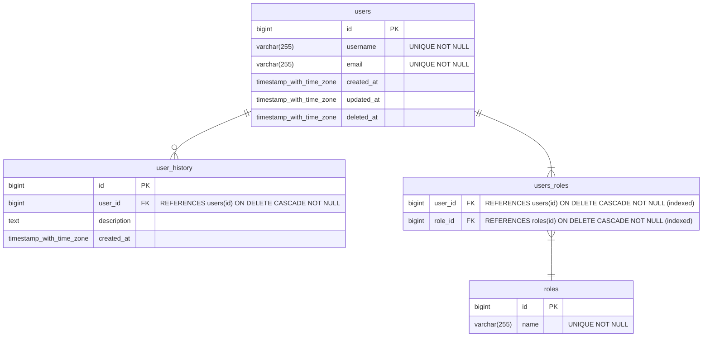
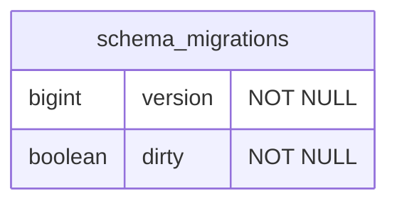

# Database

This document contains database schema related content.

## Incident

Following is the incident schema

```mermaid
erDiagram

    incident_types {
        %% Descibe the type of incident (eg: threat, injury, death...)
        bigint id PK
        varchar(255) label "UNIQUE NOT NULL"
        text description 
        boolean is_active "NOT NULL" DEFAULT true
    }

    incident_targets {
        %% Describe the target of the incident (eg: human, pet, livestock, vehicule, property...)
        bigint id PK
        varchar(255) label "UNIQUE NOT NULL"
        text description
        boolean is_active "NOT NULL" DEFAULT true
    }

    incident_causes {
        %% Describe the cause of the incident (eg: unknown, alcool, drug, age, safety measure non respect, accident, other...)
        bigint id PK
        varchar(255) label "UNIQUE NOT NULL"
        text description
        boolean is_active "NOT NULL" DEFAULT true
    }

    incident_status_enum {
        Pending NA "Pending" 
        Verified NA "Verified" 
        Not_verifiable NA "Not_verifiable" 
        Rejected NA "Rejected" 
    }

    incidents {
        bigint id PK
        bigint incident_type_id FK "REFERENCES incident_types(id) ON DELETE RESTRICT NOT NULL (indexed)"
        bigint incident_target_id FK "REFERENCES incident_targets(id) ON DELETE RESTRICT NOT NULL (indexed)"
        bigint incident_cause_id FK "REFERENCES incident_causes(id) ON DELETE RESTRICT NOT NULL (indexed)"
        timestamp_with_time_zone date "NOT NULL (indexed)"
        bigint town_id FK "REFERENCES towns(id) ON DELETE RESTRICT NOT NULL"
        text title "NOT NULL"
        text description "NOT NULL"
        timestamp_with_time_zone created_at 
        timestamp_with_time_zone updated_at 
        timestamp_with_time_zone deleted_at 
        incident_status incident_status "NOT NULL DEFAULT 'Pending'"
        ft_searchable tsvector "GENERATED ALWAYS AS (to_tsvector('french',title || ' ' || description)) STORED  (indexed)"
    }

    incidents }|--|| incident_types : ""
    incidents }|--|| incident_targets : ""
    incidents }|--|| incident_causes : ""

    incident_sources {
        bigint id PK
        bigint incident_id FK "REFERENCES incidents(id) ON DELETE CASCADE NOT NULL (indexed)"
        text description
        text source
    }

    incidents ||--o{ incident_sources : ""

    incident_history {
        %% history of the incident report (changes, who created it, when, who validated it, when, who closed it, when, why, how...)
        bigint id PK
        bigint incident_id FK "REFERENCES incidents(id) ON DELETE CASCADE NOT NULL"
        bigint user_id FK "REFERENCES users(id) ON DELETE CASCADE NOT NULL"
        text description
        timestamp_with_time_zone created_at 
    }
    
    incidents ||--o{ incident_history: ""
    incident_history }|--|| users: ""

    %% incident -> municipality -> zip_code with its location. That way we get a nice precise location

    towns {
      bigint id PK
      varchar[5] insee_code
      text town_name
      varchar[5] zip_code "(indexed)"
      text routing_label
      text line_5
      geography(POINT_4326) geopoint "(indexed)"
      ft_searchable tsvector "GENERATED ALWAYS AS (to_tsvector('french', zip_code || ' ' || town_name || ' ' || routing_label || ' ' || line_5)) STORED (indexed)"
    }

    incidents }o--|| towns: ""

```



## Authentication

Here are user and role related schemas



## Migration

Database migration is managed by golang-migrate. Following is the used schema



## Geo data

Geographical data comes from [La Poste DataNova](https://datanova.laposte.fr/datasets/laposte-hexasmal). [The file](./base-officielle-codes-postaux.csv) in this repository is a CSV export of all cites with center coordinates.

The file [processed_town.csv](./processed_town.csv) is an export of town compatible with database schema. It can be loaded with:

```sh
psql -h localhost -p 5432 -d postgres -U postgres -c "\copy towns from 'doc/database/processed_town.csv' with delimiter as ',' CSV HEADER"
```

